[KOREAN](https://github.com/JunyHarang-Open-Source-project/openstack-getGlanceImage/blob/master/README.md) | [For English](https://github.com/JunyHarang-Open-Source-project/openstack-getGlanceImage/blob/master/README.en.md)

# OpenStack Glance Image Download Program

## 🚀 what's this for
* You can get virtual images to Glance more conveniently in the OpenStack Controller Node.

## 🚀 How to Use
### 🔽 Please download all shell scripts!
  ```bash
  git clone https://github.com/JunyHarang-Open-Source-project/openstack-getGlanceImage.git
  ```
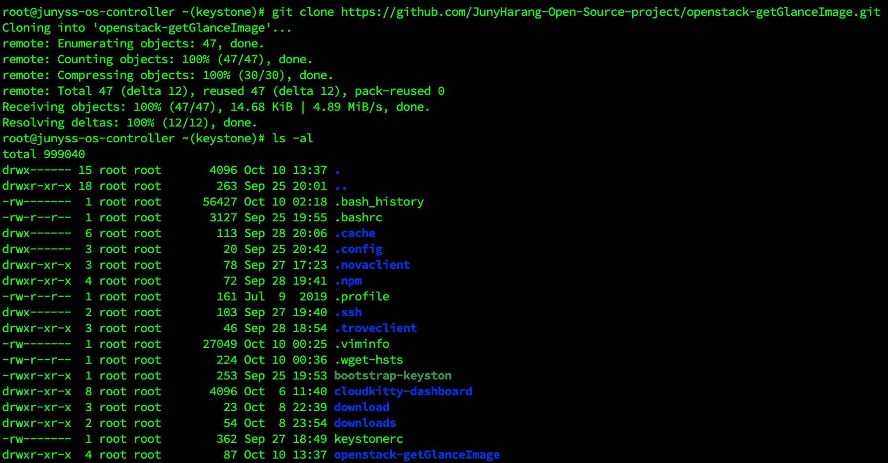
<br><br>

### 🔽 Please grant permission to run OpenStack/glance/createOpenStackImages.sh
   ```bash
    chmod +x your/path/openstack-getGlanceImage/glance/createVirtualMachineImage/createOpenStackImages.sh
   ```

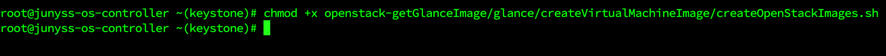
<br><br>

### 🔽 Please run createOpenStackImages.sh .
  ```bash
    your/path/openstack-getGlanceImage/glance/createVirtualMachineImage/createOpenStackImages.sh
  ```
<br><br>
### 🔽 Please select the OS type you want to download.
#### 📦 Selective Download
<br><br>
<br><br>
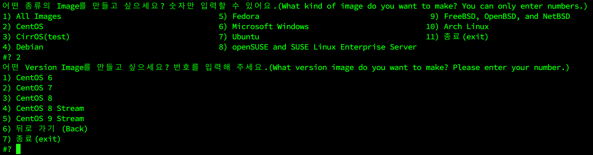<br><br>

- If you select number 1, you can select the OS image you need and download it.<br><br>
  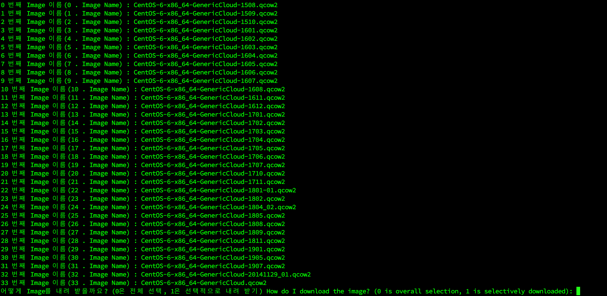
- Check the list that can be downloaded, and if you enter 0, you can download the entire image, and if you enter 1, you can select and download only the image you need.<br><br>
  
- Please check the list to see the images you need and enter the number of downloads.<br><br>
  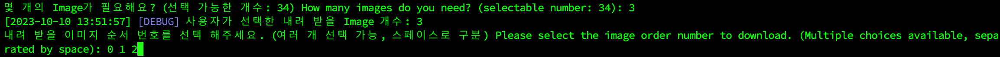
- Please enter the required number and check the list to enter a number based on the space of the required images.<br><br>
  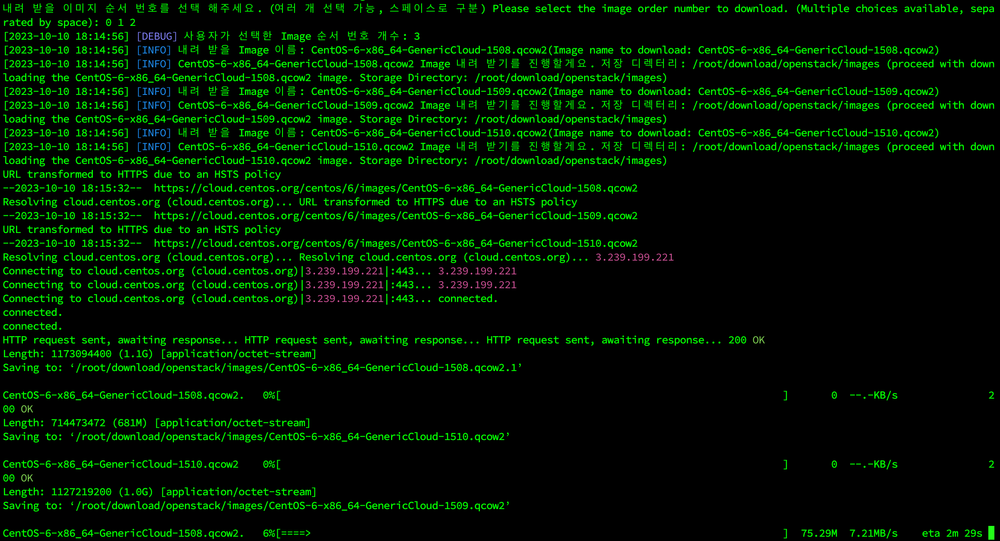
- As above, downloading the image from list 0 to 2 in parallel will proceed at the same time.<br><br>
  
  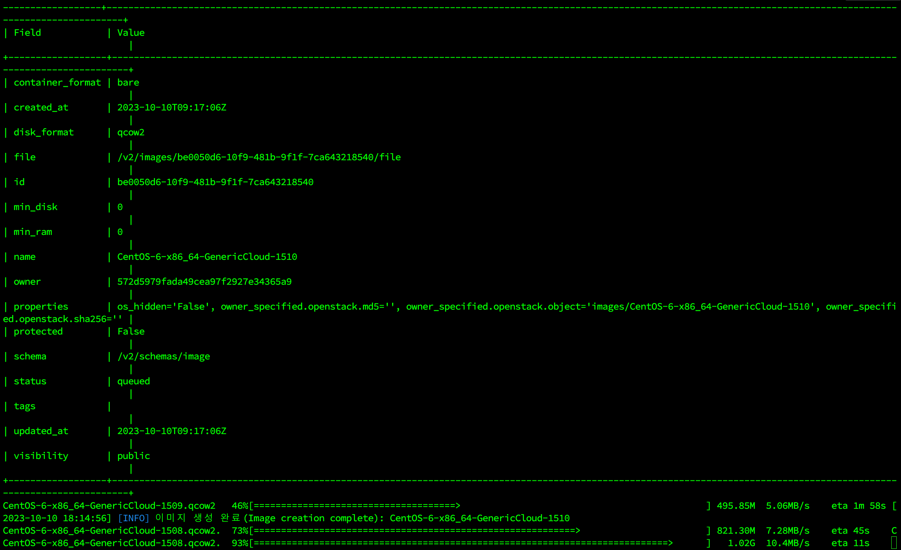
- If the image download is successful, it automatically generates a Glance image in parallel.<br><br>
  
- Please select whether you want to delete the downloaded image. If you enter n or N, no, NO, we will not delete it, and we will move on.
- Number 0 is deleted by selecting number 1 of the entire image received above.
- If you delete it, the Glance image remains the same, and only the downloaded image is deleted.<br><br>
  
- As above, you can selectively delete only the images you want to delete.<br><br>
  
- You can see that the image is successfully registered in OpenStack.<br><br><br><br>

#### 📦 Download a full specific OS image
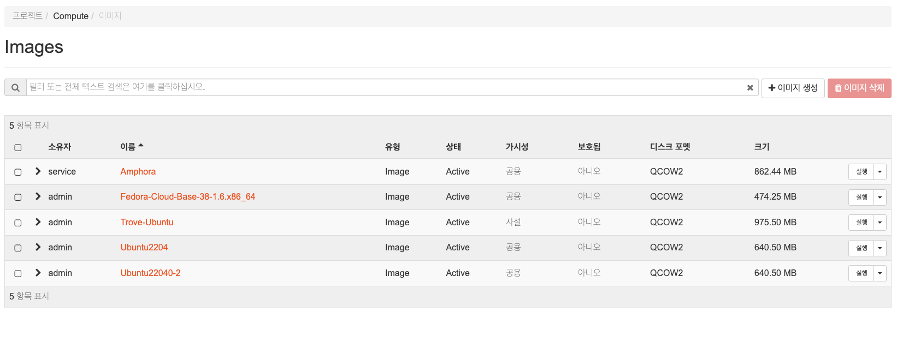
- Let's proceed with the full download without CentOS 6 Image being registered.<br><br>
  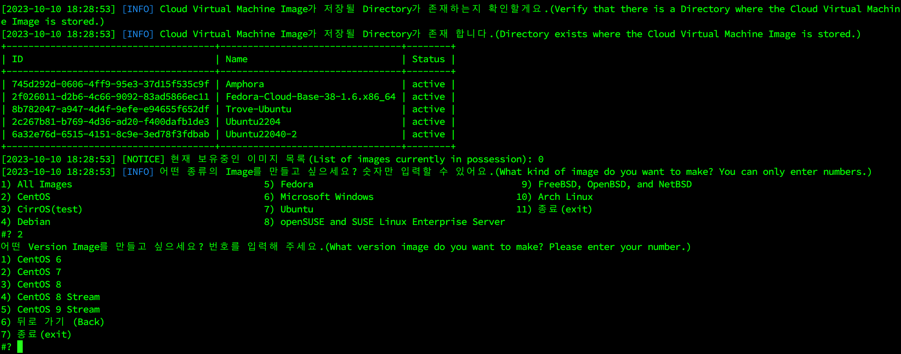
  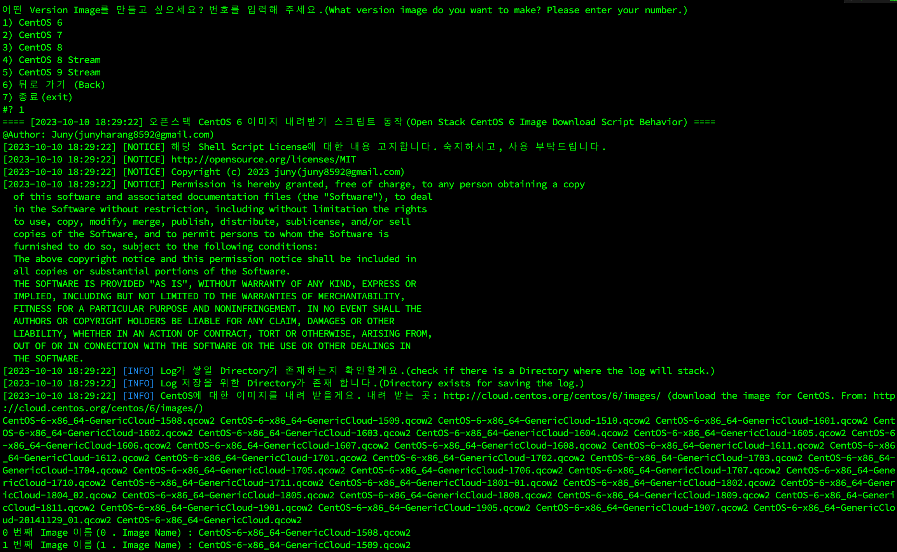
  <br><br>
  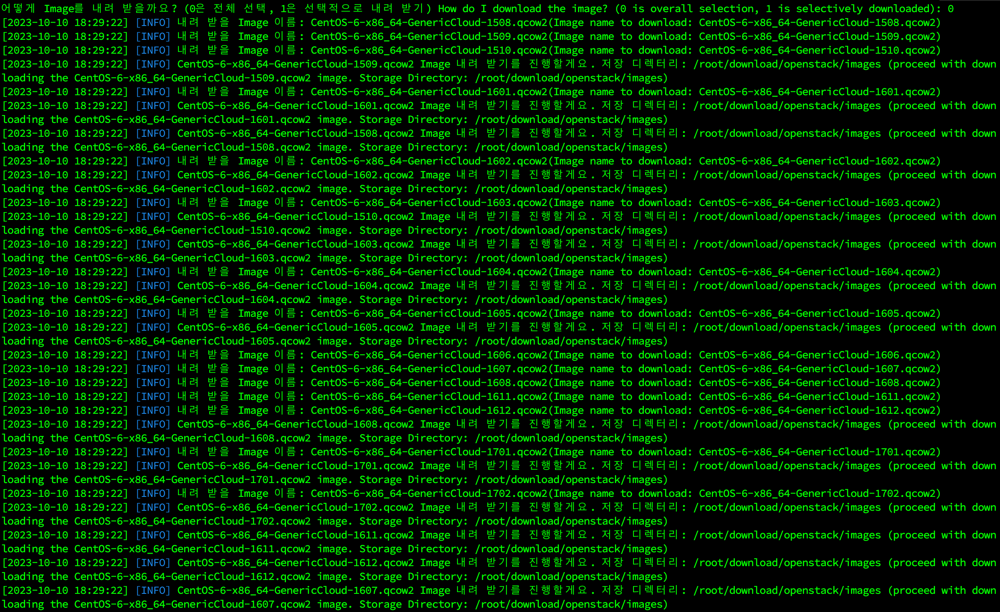
  
  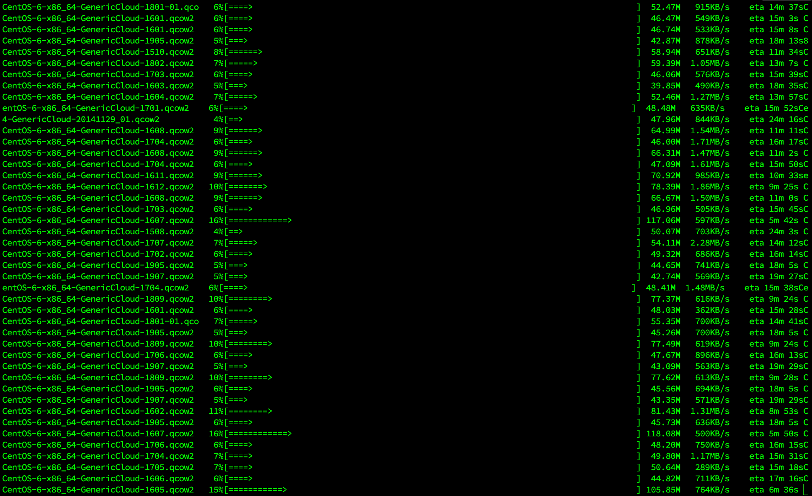
- If you choose number 0, you can download the entire image of the OS in parallel and register it as Glance.<br><br>
  
  <br><br>
  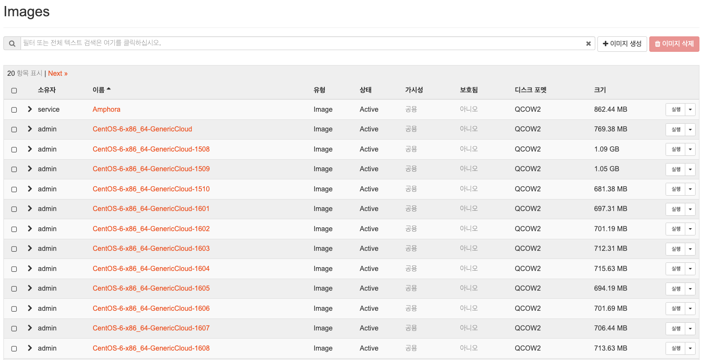
  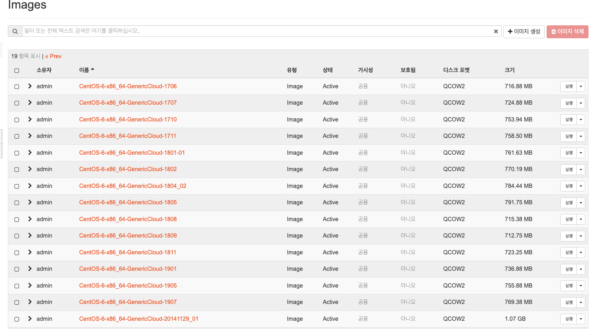
- You can download all the images of a specific OS and register them on Glance.<br><br>
  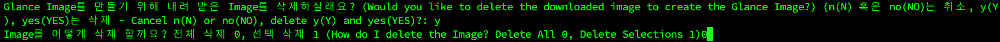
  
  
  
- If you select Delete All, you can erase all images at once as above.<br><br>

#### 📦 Lastly


- When you're done, and you're back here, you can type 11 if you want to end it.
<br><br>

### 🔽 Realese Note
https://github.com/JunyHarang-Open-Source-project/openstack-getGlanceImage/releases

### 🔽 Where should I leave the inquiry while using it?
   - **Please email me to junyharang8592@gmail.com. 🤭**
   - **Juny Harang Tech Blog: https://junyharang.tistory.com/**